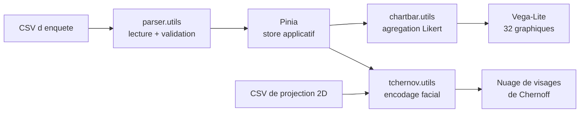

# Architecture et spécifications techniques

Ce document décrit la chaîne de traitement des enquêtes, le format d'entrée attendu
et l'encodage par visages de Chernoff.

---

## 1. Vue d'ensemble

L'application est **entièrement côté client** : aucun serveur, aucune base. Le CSV
est lu, analysé et visualisé dans le navigateur.



C'est un choix structurant : **aucune réponse d'enquête ne quitte le poste de
l'utilisateur**. Sur des données de qualité de vie au travail, potentiellement
ré-identifiantes, c'est la garantie la plus simple à tenir.

| Couche | Fichier | Rôle |
| --- | --- | --- |
| Lecture | `src/utils/parser.utils.js` | analyse CSV, détection de séparateur, extraction des catégories |
| Agrégation | `src/utils/chartbar.utils.js` | comptage des réponses Likert par modalité |
| Encodage facial | `src/utils/tchernov.utils.js` | discrétisation des moyennes vers les traits |
| État | `src/store/datastore.js` | store Pinia partagé entre les vues |
| Vues | `src/pages/`, `src/components/` | tableau de bord et nuage de visages |

---

## 2. Analyse du CSV

Le parseur est écrit à la main plutôt que délégué à une bibliothèque, et gère les
cas que produisent réellement les exports d'enquêtes :

| Cas | Traitement |
| --- | --- |
| Séparateur inconnu | détection automatique entre `,`, `;` et tabulation, par comptage hors guillemets |
| Guillemets échappés | `""` à l'intérieur d'un champ cité |
| Séparateur dans un champ cité | ignoré tant que le champ n'est pas refermé |
| BOM UTF-8 | retiré en tête de fichier |
| Décimales à virgule | `2,33` converti en `2.33` |
| Lignes vides | écartées |

La détection de séparateur est faite **hors guillemets**, ce qui évite le piège
classique d'un commentaire libre contenant des points-virgules.

---

## 3. Format d'enquête attendu

```text
[ 16 colonnes de métadonnées ] [ colonnes de questions ]
```

Les questions sont regroupées par préfixe de catégorie, avec une moyenne
optionnelle préfixée `MOY_` :

```text
PGC1, PGC2, PGC3, MOY_PGC, EVPVP1, EVPVP2, EVPVP3, MOY_EVPVP, ...
```

Les catégories sont déduites du nom des colonnes : `categoryName()` retire les
chiffres et suffixes connus, et une colonne dont le nom reste inchangé après ce
nettoyage est considérée comme une moyenne de catégorie.

> **Limite assumée.** Le nombre de colonnes de métadonnées est une constante
> (`INDEX_FIRST_QUESTION = 16`). Un export dont la structure diffère décalerait la
> détection des catégories. Une détection par motif — première colonne dont le nom
> suit le format d'un identifiant de question — serait plus robuste.

Les réponses sont des entiers de 1 à 5 (échelle de Likert). Toute valeur hors
intervalle ou non numérique est écartée du comptage plutôt que comptée comme zéro,
ce qui fausserait les distributions.

---

## 4. Tableau de bord

Chaque question produit un histogramme des cinq modalités, rendu par Vega-Lite.


Les graphiques sont groupés par catégorie, la moyenne de catégorie affichée en
premier de chaque groupe. Les catégories sont ensuite réparties **équitablement**
sur les colonnes :

```js
const columnCount = Math.min(4, Math.max(1, Math.ceil(categories.length / 3)))
categories.forEach((category, index) => columns[index % columnCount].push(category))
```

> Les bornes étaient auparavant codées en dur (`slice(0,8)`, `slice(8,13)`…). Sur une
> enquête de moins de neuf catégories, tout s'entassait dans la première colonne et
> les trois autres restaient vides.

---

## 5. Visages de Chernoff


### Le principe

Un visage de Chernoff encode plusieurs variables numériques dans les traits d'un
visage stylisé. L'idée repose sur un fait cognitif : l'œil humain compare des
visages bien mieux qu'il ne compare des colonnes de chiffres.

Dans cette application, l'utilisateur associe **quatre catégories d'enquête** à
quatre traits :

| Trait | Rôle |
| --- | --- |
| Yeux | catégorie 1 |
| Forme du visage | catégorie 2 |
| Couleur | catégorie 3 |
| Bouche | catégorie 4 |

La moyenne de chaque catégorie, pour chaque répondant, est discrétisée sur une
échelle de 1 à 5. La combinaison des quatre valeurs — soit 5⁴ = 625 possibilités —
désigne un visage pré-généré.

### Positionnement

Les coordonnées viennent d'un **second CSV de projection** (`x`, `y`), une ligne par
répondant, produit en amont par une réduction de dimension. L'application ne calcule
pas cette projection : elle la consomme.

Cette séparation permet d'employer la méthode de projection de son choix — ACP,
t-SNE, UMAP — sans modifier l'application.

### Quand cette visualisation est pertinente, et quand elle ne l'est pas

**Pertinente** pour repérer des groupes visuellement, sur un effectif modéré, quand
les quatre dimensions ont un sens métier pour le lecteur.

**Peu pertinente** dès que l'effectif dépasse la centaine de points — les visages se
chevauchent — ou lorsqu'une lecture précise est nécessaire. L'œil ne compare pas
tous les traits avec la même sensibilité : un changement de bouche saute aux yeux
davantage qu'un changement de forme, ce qui introduit un biais de perception selon
la variable assignée à chaque trait.

C'est une visualisation d'**exploration**, pas de restitution.

---

## 6. Confidentialité

Les jeux de données d'enquête d'origine ont été **retirés du dépôt public**. Ils
contenaient des attributs démographiques et organisationnels qui, croisés,
permettaient une ré-identification : dans un service de six personnes, la
combinaison tranche d'âge × ancienneté × type de contrat suffit souvent à
identifier quelqu'un.

Ils sont remplacés par deux fichiers synthétiques dans `public/examples/`, qui ne
représentent ni employés ni organisation réels.

Le traitement restant entièrement local dans le navigateur, aucune réponse n'est
transmise nulle part.

---

## 7. Limites connues

- **`INDEX_FIRST_QUESTION` est une constante** : le format d'entrée est rigide et
  n'est pas validé explicitement.
- **625 images PNG pré-générées** (7,5 Mo) pour couvrir les combinaisons de traits.
  Les générer en SVG à la volée diviserait le poids du dépôt par vingt et serait
  techniquement plus démonstratif.
- **Aucun test unitaire.** L'intégration continue se limite au lint et au build,
  alors que `parser.utils.js` et `chartbar.utils.js` sont des fonctions pures,
  parfaitement testables.
- **Pas de gestion d'erreur visible** si le CSV de projection ne correspond pas au
  nombre de répondants.
