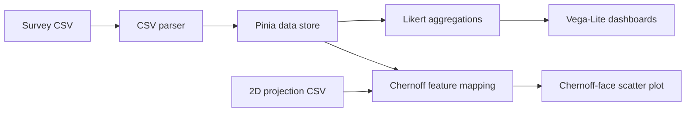

# QVTi — Quality of Work Life Analytics

Interactive web application for exploring **quality-of-work-life survey data**. The project transforms survey responses into visual summaries and provides an experimental **Chernoff-face visualization** to compare multidimensional observations.

> **Public-repository note:** the original workplace survey datasets have deliberately been removed from this repository. They contained demographic and organisational attributes that could create privacy and re-identification risks. Synthetic example files are provided instead.

## What this project demonstrates

- Client-side ingestion and parsing of CSV survey data
- Data-quality checks for missing or invalid Likert responses
- Aggregation of 1–5 survey responses by question and category
- Interactive chart generation with **Vega / Vega-Lite**
- Application state management with **Pinia**
- A custom multidimensional visualization based on **Chernoff faces**
- Mapping four selected survey dimensions to visual facial features
- Integration of 2D projection coordinates with survey observations
- Responsive Vue component architecture

## Tech stack

- **Vue 3**
- **JavaScript**
- **Pinia**
- **Vega / Vega-Lite / Vega-Embed**
- **PixiJS**
- **Vue Router**
- **HTML / CSS**

## Data flow



## Privacy-safe demo data

The repository includes two **synthetic** files:

- `public/examples/survey_sample.csv`
- `public/examples/projection_sample.csv`

They are generated only to demonstrate the application and do not represent real employees or organisations.

The survey format expects **16 metadata columns** followed by question columns. Question identifiers are grouped by category (for example `ENG1`, `ENG2`, `ENG3`) and may include a category mean such as `MOY_ENG`.

The projection file contains two numeric columns (`x`, `y`), one row per survey observation.

## Run locally

### Requirements

- Node.js 18+
- npm

### Installation

```bash
npm install
npm run serve
```

Then open the local URL printed by Vue CLI.

For a production build:

```bash
npm run build
```

For static analysis:

```bash
npm run lint
```

## Try the demo

1. Start the application.
2. On **Dashboard**, upload `public/examples/survey_sample.csv` as **Survey CSV**.
3. Upload `public/examples/projection_sample.csv` as **Projection CSV**.
4. Explore the survey bar charts.
5. Open **Chernoff faces** and select four survey categories to map them to face features.

## Project structure

```text
src/
├── components/
│   ├── Card/
│   ├── CharBarGroup/
│   ├── ChartBar/
│   └── Chernoff/
├── pages/
├── router/
├── store/
└── utils/
    ├── constants/
    ├── chartbar.utils.js
    ├── parser.utils.js
    └── tchernov.utils.js

public/
└── examples/              # synthetic demo data
```

## Chernoff-face visualization

Chernoff faces encode several numerical variables as facial characteristics. In this project, a user selects four survey categories, and their mean values are discretized to a 1–5 scale. Each combination maps to one of the pre-generated face assets used in the scatter plot.

The 2D positions are supplied separately so that the facial encodings can be combined with a projection or embedding generated by an external analytical workflow.

## Public-repository cleanup

This GitHub-ready version intentionally:

- removes original workplace survey CSV/JSON datasets;
- removes unused Firebase configuration and dependencies;
- removes legacy preprocessing and unused chart code;
- fixes Pinia getter access and CSV parsing;
- improves invalid-response handling;
- fixes file-upload event handling;
- fixes Chernoff row alignment and decimal parsing;
- adds synthetic sample data and GitHub Actions CI.

## Context

This project was originally developed as a team/academic application around quality-of-work-life survey analysis. It is presented here as a portfolio project focused on **data processing, visualization and software engineering**.

---

### Suggested repository topics

`vue` · `javascript` · `data-visualization` · `data-analysis` · `vega-lite` · `pinia` · `csv` · `chernoff-faces` · `survey-analysis`
