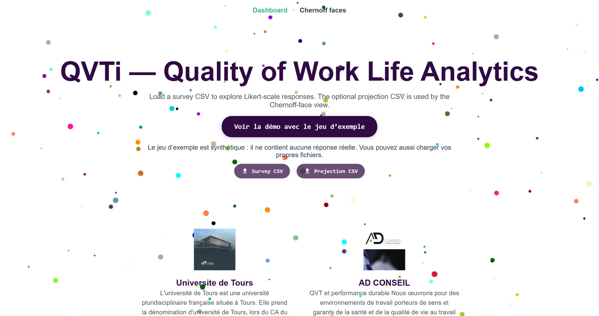
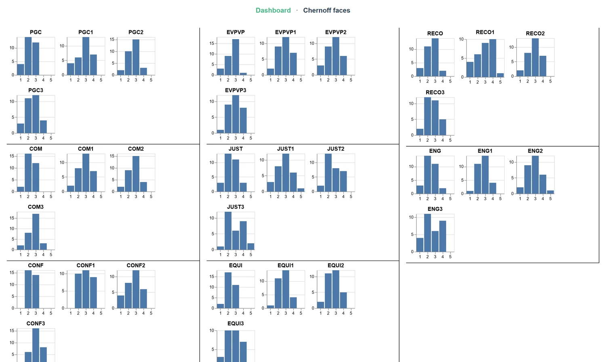
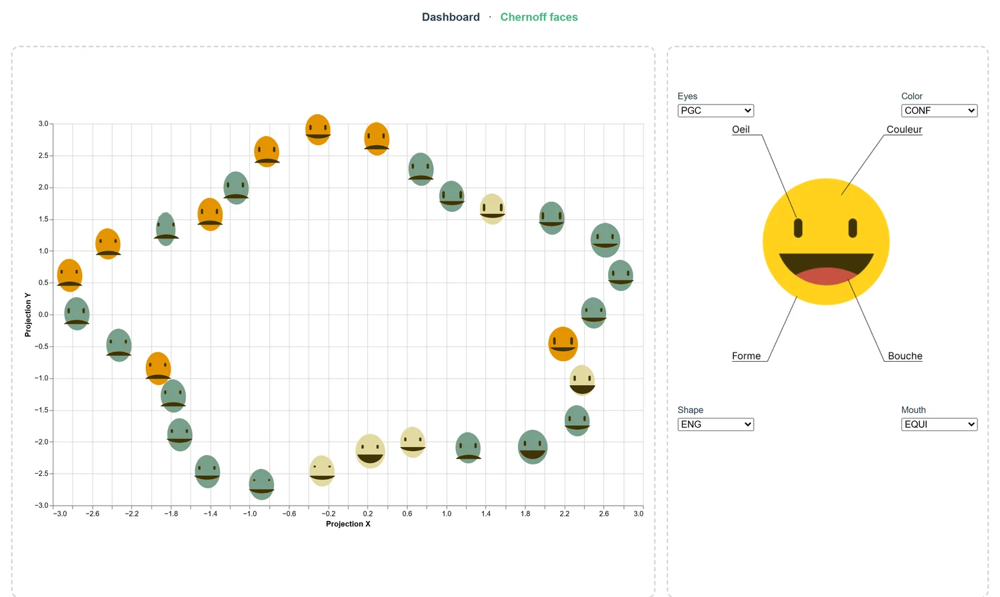

# Guide d'utilisation

L'application explore des réponses d'enquête sur la qualité de vie au travail. Deux
vues : un tableau de bord des distributions, et un nuage de visages de Chernoff.

---

## 1. Charger des données



### Le plus rapide

**« Voir la démo avec le jeu d'exemple »** charge les deux fichiers synthétiques
fournis. Un clic, rien à préparer.

### Avec vos propres données

Deux fichiers, le second facultatif :

| Fichier | Contenu | Requis |
| --- | --- | --- |
| **Survey CSV** | les réponses d'enquête | oui |
| **Projection CSV** | les coordonnées 2D des répondants | seulement pour les visages |

**Vos fichiers ne quittent pas votre navigateur.** Il n'y a ni serveur ni envoi :
tout est lu et traité localement.

### Format attendu

```text
respondent_id, team, site, ... (16 colonnes de métadonnées)
PGC1, PGC2, PGC3, MOY_PGC, EVPVP1, EVPVP2, EVPVP3, MOY_EVPVP, ...
```

- 16 colonnes de métadonnées, puis les questions ;
- les questions sont groupées par préfixe : `PGC1`, `PGC2`, `PGC3` forment la
  catégorie `PGC` ;
- une colonne `MOY_PGC` est reconnue comme moyenne de la catégorie ;
- les réponses sont des entiers de 1 à 5.

Le fichier de projection contient deux colonnes numériques `x` et `y`, une ligne par
répondant, dans le même ordre que l'enquête.

Le séparateur (`,`, `;` ou tabulation) est détecté automatiquement, et les décimales
à virgule sont acceptées.

---

## 2. Tableau de bord



Chaque histogramme montre la distribution des réponses d'une question sur l'échelle
de 1 à 5. Le premier graphique de chaque groupe est la moyenne de la catégorie,
suivi des questions qui la composent.

### Comment le lire

| Forme de la distribution | Lecture |
| --- | --- |
| Pic marqué sur 4-5 | consensus favorable |
| Pic marqué sur 1-2 | consensus défavorable |
| **Deux pics aux extrêmes** | population **polarisée** — la moyenne est trompeuse |
| Distribution plate | absence de consensus, ou question mal comprise |

> Le cas bimodal est celui qui justifie ces histogrammes. Une catégorie dont la
> moyenne est 3,0 peut correspondre à un consensus tiède ou à deux groupes
> opposés — deux situations qui n'appellent pas les mêmes actions. La moyenne seule
> ne les distingue pas.

Les réponses hors échelle sont écartées du comptage, et non comptées comme zéro, ce
qui déformerait la distribution.

---

## 3. Visages de Chernoff



### Utilisation

Choisissez une catégorie d'enquête pour chacun des quatre traits :

| Trait | À associer à |
| --- | --- |
| **Eyes** | une catégorie |
| **Shape** | une catégorie |
| **Color** | une catégorie |
| **Mouth** | une catégorie |

Chaque visage est un répondant, positionné selon les coordonnées du fichier de
projection. Ses traits encodent ses moyennes sur les quatre catégories choisies.

### Comment le lire

Cherchez des **groupes de visages semblables** : ils partagent un profil de réponse.
Un groupe isolé dans le nuage avec des traits distincts signale un segment de
population à examiner.

### Une précaution de lecture

L'œil ne compare pas tous les traits avec la même sensibilité. Un changement de
bouche saute aux yeux davantage qu'un changement de forme du visage. **La variable
placée sur la bouche paraîtra donc plus déterminante qu'elle ne l'est.**

Une bonne pratique consiste à permuter les affectations et à vérifier que la lecture
tient. Si les groupes disparaissent quand on échange deux traits, c'est
l'encodage qui les créait, pas les données.

C'est une visualisation d'**exploration**, pas de restitution : elle sert à formuler
des hypothèses, à confirmer ensuite sur le tableau de bord.

### Quand elle cesse d'être utile

Au-delà d'une centaine de répondants, les visages se chevauchent et la lecture
devient impossible. Sur des effectifs plus larges, préférez un nuage classique avec
couleur et taille.

---

## 4. Confidentialité

Les jeux de données d'origine ont été retirés du dépôt public : croisés, les
attributs démographiques et organisationnels permettaient de ré-identifier des
répondants. Dans un service de six personnes, tranche d'âge × ancienneté × type de
contrat suffit souvent.

Si vous chargez de vraies réponses, cette même précaution vous concerne au moment de
partager une capture d'écran.
